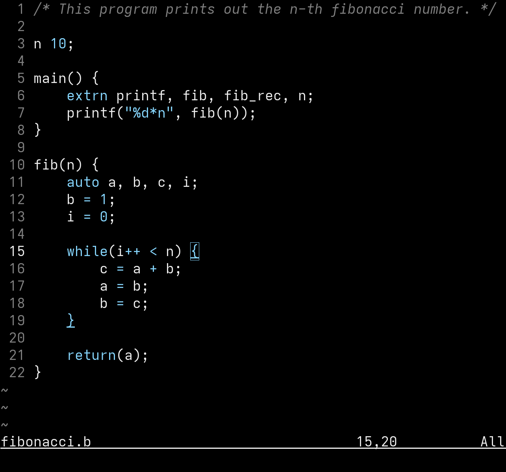

<h1 align="center">B Syntax</h1>
<p align="center">Simple B syntax highlighting for vim.</p>


## Install
Using [vim-plug](https://github.com/junegunn/vim-plug)
```Vim
Plug 'miublue/b-syntax.vim'
```

## Configuration

Enable function highlighting (off by default):
```Vim
let g:b_highlight_functions = 1
```

Disable operator highlighting (on by default):
```Vim
let g:b_highlight_operators = 0
```

Enable [bext's extensions](https://github.com/bext-lang/b) (off by default):
```Vim
let g:b_extended_syntax = 1
```

